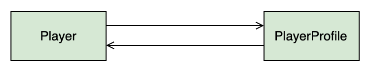
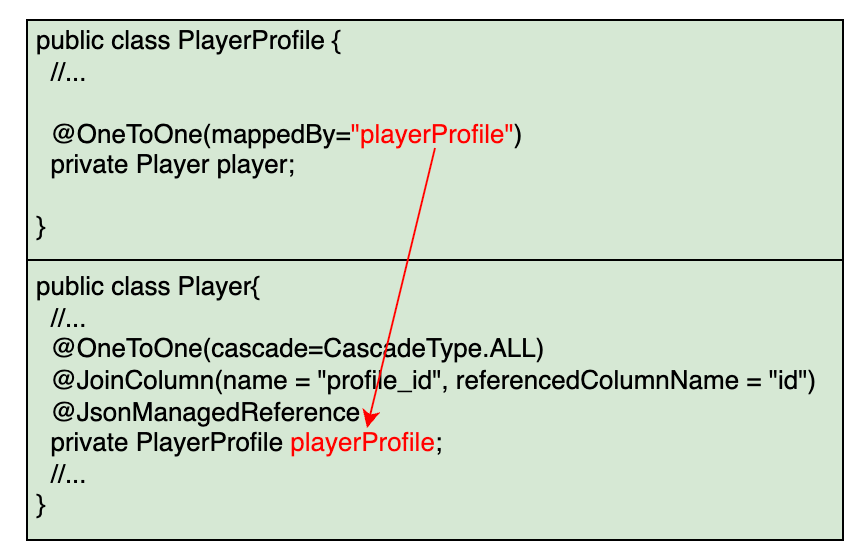
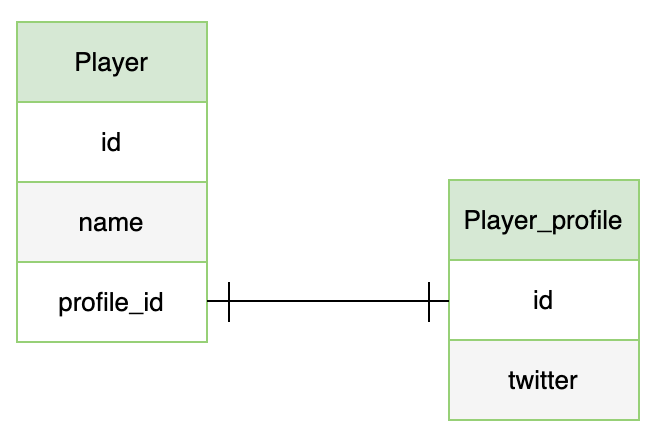
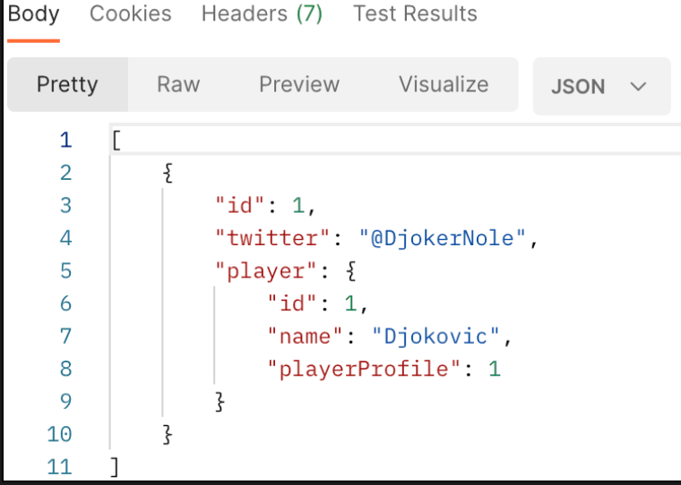
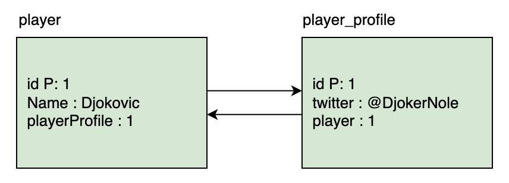
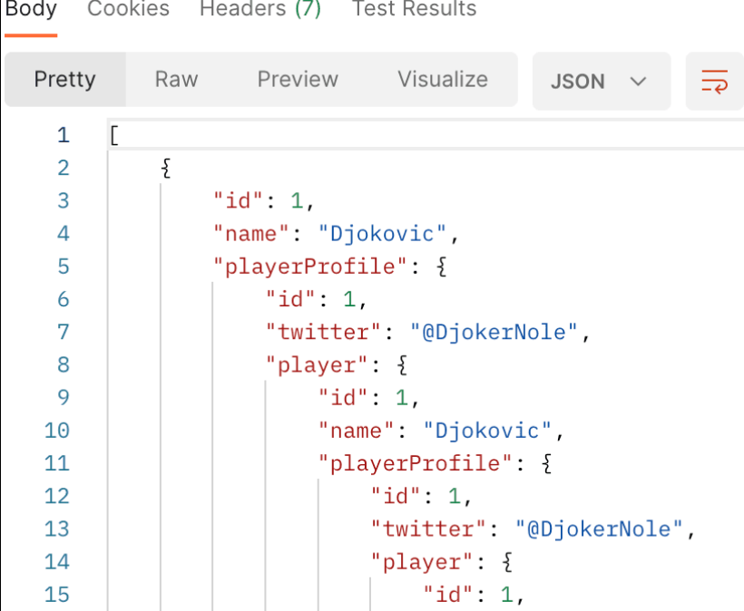
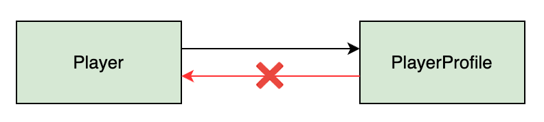
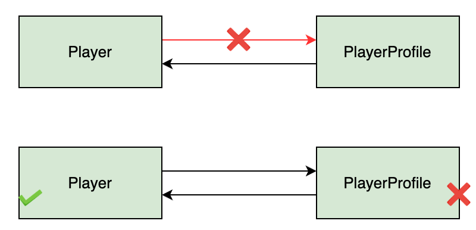

# One-to-One Unidirectional Relationship
___
To model a one-to-one relationship, consider the scenario where a player has a profile that stores his details. We have a player table which stores the basic information about the player like id and name and a player_profile table which stores the additional details like the social media accounts of the players. There is a one-to-one relationship between player and player-profile tables, and in this lesson, we will model it as a one-way/ unidirectional relationship.

## Creating entities
- Create a `Player` class and mark it as an entity using `@Entity` annotation. We will only create id and player name fields at the moment to keep this example simple.

- Since `Id` is the primary key, we will mark it with `@Id` annotation and let Hibernate generate values for this column using the `@GeneratedValue` annotation and a `GenerationType` of `IDENTITY`. Hibernate requires a default constructor. We will also create an overloaded constructor to create the object using fields, getters and setters for the fields, and a `toString()` method.
```java
@Getter
@Setter
@Entity
public class Player {

    @Id
    @GeneratedValue(strategy = GenerationType.IDENTITY)
    private int Id;

    private String name;
}
```
- Next, we will create the `PlayerProfile` class in the `one-to-one` package to hold miscellaneous information about a player and also mark it as an `entity`. For now, this class will only store the player’s Twitter account handle.
```java
@Getter
@Setter
@Entity
public class PlayerProfile {
    @Id
    @GeneratedValue(strategy = GenerationType.IDENTITY)
    private int Id;
    private String twitter;

    //constructor
    //getters and setters
    //toString method
}
```
- We will mark the primary key with `@Id` annotation and generate the constructors, getters, setters and `ToString()` method as we did for the `Player` class. The full code of the `PlayerProfile` class can be seen from the executable code widget.

## One-to-One relationship
- In SQL, we represent relationships using primary key and foreign key. Foreign keys are used to link tables together. A foreign key is a field in one table that refers to the primary key in another table. We will see how the same can be achieved using Hibernate (which is the default implementation of Spring Data JPA).

- For the example taken in this lesson, the `Player` class has a one-to-one relationship with the `PlayerProfile` class. To show this relationship, we will add a field `playerProfile` to the `Player` class and use the JPA annotation `@OneToOne` on this field. `@OneToOne` is a JPA annotation which maps a source entity to a target entity.
```java
@OneToOne
  private PlayerProfile playerProfile;
```
## Cascade property
- The `cascade` property ensures that changes made to a `Player` entity are reflected in the `PlayerProfile` entity. 
- The `PlayerProfile` entity does not have a meaning of its own, rather, it defines the `Player` entity. 
- If we delete a `Player` entity, the associated details should also be deleted. Cascading allows an operation on the `Player` entity to be propagated to the `PlayerProfile` entity.
```java
@Entity
public class Player {
    //...

    @OneToOne(cascade= CascadeType.ALL)
    private PlayerProfile playerProfile;

    //...
}
```
- We have set the `CascadeType` to `ALL`. This means that all JPA and Hibernate specific operations on the `Player` entity will be propagated to the `PlayerProfile` entity.
> - **Note**: The absence of the cascade property, results in the TransientPropertyValueException exception when Hibernate tries to save a Player object containing a nested PlayerProfile object.

## @JoinColumn
- In relationships, one side is the owning side. We use the `@JoinColumn` annotation on the owning side. 
- Here, the `Player` class is the owning side of the relationship. The `@JoinColumn` annotation specifies the name of the foreign key column in the player table. 
- We will call the column `profile_id`. If the name is not specified, then JPA names the column based on some rules.

In the `player_profile` table, the column that is being `referenced` is id. The name of the corresponding field in the `PlayerProfile` class is `Id`, which we specify as `referencedColumnName`.
```java
@Entity
public class Player {

    //...
    
    @OneToOne(cascade= CascadeType.ALL)
    @JoinColumn(name="profile_id", referencedColumnName="id")
    private PlayerProfile playerProfile;

    //...

}
```
- We have also added a getter and setter for the new field and updated the `ToString()` method.

- After adding the @OneToOne annotation, if we run the application and check the H2 database, we can see that the player table has changed. It now contains a profile_Id column, which references the id column in the player_profile table. The player table is called the owning table because here we store the foreign key.

- It is a unidirectional relationship because we have the reference of the `PlayerProfile` entity in the `Player` entity but we don’t have any reference of the `Player` entity in the `PlayerProfile` entity. We can retrieve the `PlayerProfile` object using the `Player` object but not the other way round.


## Creating repositories
Next, we will create repositories for both classes, `Player` and `PlayerProfile`, that extend the `JpaRepository` interface. Since `JpaRepository` is a generic type, we need to specify the type of object as well as the datatype of the primary key.

We will create two interfaces named `PlayerRepository` and `PlayerProfileRepository` and annotate them with `@Repository` to leverage the exception translation facility offered by Spring.
```java
@Repository
public interface PlayerRepository extends JpaRepository <Player, Integer> {
}

@Repository
public interface PlayerProfileRepository extends JpaRepository <PlayerProfile, Integer> {
}
```

## Persisting records
- We can create a Player entity by sending a POST request to /players with the following request body:
```java
{
  "name": "Federer"
}
```
From the response, it can be seen that Hibernate assigns the player an id of 1.
```java
{
 "twitter" : "@rogerfederer"
}
```
Next, we will create a PlayerProfile entity by sending a POST request to /profiles.


## Connecting player to profile
- Right now, both entities are not connected. To assign the `PlayerProfile` to `Player`, we need to create a PUT mapping in the `PlayerController` class. This will enable us edit the `Player` entity and associate a `PlayerProfile` with it.

- First, we need to write the service layer method. Create a method named `assignProfile` in the `PlayerService` class. This method is responsible for updating a Player record. It simply uses the setter method for the `playerProfile` field and then calls `save()` to update the record in the database.

```java
public Player assignProfile(int id, PlayerProfile profile) {
    Player player = repo.findById(id).get();
    player.setPlayerProfile(profile);
    return repo.save(player);
}
```

- Now we can add a method in the `PlayerController` class which maps a PUT request to `/players/{id}/profiles/{profile_id}` and updates the `Player` entity. Create a method named `assignDetail()` in the `PlayerController` class. Using the `profile_id` from the URI, we retrieve the `PlayerProfile` entity and then pass it to the `assignProfile` method in the `PlayerService` class.

- To be able to access the `PlayerProfileService`, we need to autowire it in the `PlayerController` class.
```java
public class PlayerController {
	@Autowired
	PlayerService service;
	
	@Autowired
	PlayerProfileService profileService;

    //...

    @PutMapping("/{id}/profiles/{profile_id}")
    public Player assignDetail(@PathVariable int id, @PathVariable int profile_id) {
        PlayerProfile profile = profileService.getPlayerProfile(profile_id); 
        return service.assignProfile(id, profile);
    }
}
```
- With the above service and controller methods in place, we can send a PUT request to `/players/1/profiles/1`. This request will update the `Player` with id `1` and assign the `PlayerProfile` object with id `1` to it.


- A POST request to `/players` shows that the relationship has been established.
```json
[
  {
    "name": "Federer",
    "playerProfile": {
      "twitter": "@rogerfederer"
    }
  },
  {
    "name": "Djokovic",
    "playerProfile": {
      "twitter": "@DjokerNole"
    }
  }
]

```
- This will not only insert a row in the player table but also insert a corresponding row in the player_profile table. Hibernate fires two INSERT queries because we have set the `CascadeType` to `ALL`. This ensures that changes to the player table are propagated to the player_detail table.


- A GET request to `/players/1` shows that the relationship has been established.


- This is an example of a unidirectional one-to-one relationship. It is possible to retrieve a PlayerProfile object using a Player object but no way to retrieve a Player object using a PlayerProfile object, as can be seen from the GET request to /players and /profiles.


## Hibernate implementation of @OneToOne
Hibernate supports three variations of the `@OneToOne` mapping.
- Using foreign key with the `@JoinColumn` annotation.
- Using a common join table which has foreign keys of both tables. The @JoinTable annotation defines a new table name which has the foreign key from both tables. This helps in modelling optional one-to-one relationships. If a player does not have a `PlayerProfile` entry, we have to use null value in that column.
- Using a shared primary key to save space. This approach uses a common primary key (`player_id` in this case) in both tables using the `@PrimaryKeyJoinColumn`. It eliminates the need of having an `Id` column for the `player_profile` table.

The figure below illustrates the three ways in which `@OneToOne` annotation can be used.


## One-to-One Bidirectional Relationship
Right now, we have a unidirectional one-to-one mapping which means that if we have a Twitter account, we cannot find the name of the player who has that account. A GET request to /profiles only gets the PlayerProfile object and not the Player it is associated with.

It is however possible to find the Twitter account, if we have the Player entity. As can be seen from a GET request to /players, the PlayerProfile entities are also fetched.

- In the unidirectional one-to-one relationship, the `Player` class maintains the relationship. 
- The `PlayerProfile` class cannot see any change in the relationship.To make this relationship bidirectional, we need to make some modifications to the `PlayerProfile` class. 
- We will add a field to reference back to the `Player` class and add the `@OneToOne` annotation. 
- We will also add getter and setter methods to set the `Player` value in the `PlayerProfile` class. This will enable us to fetch the entities in both directions.


## Bi-directional relationship
To set up a bidirectional relationship, we will add a field of `Player` class in the `PlayerProfile` class and add getter and setter methods for the field. This field holds the reference to the associated `Player` entity.
```java
public class PlayerProfile {
    @Id
    @GeneratedValue(GenertionType.IDENTITY)
    private int id;
    private String twitter;

    private Player player;

    //...

    public Player getPlayer() {
		return player;
	}
	public void setPlayer(Player player) {
		this.player = player;
	}

	@Override
	public String toString() {
		return "PlayerDetail [id=" + id + ", twitter=" + twitter + ", player=" + player + "]";
	} 
}
```
- The toString() method also needs to be updated to include the newly added player field.

## mappedBy attribute
Next, we will add the `@OneToOne` annotation on the `player` field. `mappedBy` is an optional attribute of the `@oneToOne` annotation which specifies the name of the field which owns the relationship. In our case, it is the `playerProfile` field in the `Player` class. The `mappedBy` attribute is placed on the inverse side on the relationship only. The owning side cannot have this attribute.
```java
public class PlayerProfile {
	//...
	@OneToOne(mappedBy="playerProfile")
    private Player player;

    //...
}
```


- If we visit the web console of the  database (at http://localhost:8080/), we will see that there is no change in the database structure. 
- The primary key of the `player_profile` table is stored as the foreign key in the player table as shown in the `Entity` Relationship Diagram below. 
- On the Java side however, we can now access the `Player` entity using the `PlayerProfile` entity.


- To test the bidirectional relationship, we will create a Player with a nested PlayerProfile object using the following JSON POST request to http://localhost:8080/players :
```json
{
    "name": "Djokovic",
    "playerProfile": {
        "twitter" : "@DjokerNole"
    }
}
```
This request results in two `INSERT` queries in the player and `player_profile` tables respectively.

- Bidirectional relationship means that `Djokovic` owns the `@DjokerNole` Twitter account and vice versa, the `@DjokerNole` account belongs to `Djokovic`. If we now send a GET request to `/profiles` we will get the player details as well.


## JSON Infinite Recursion
If you are following along in your local dev environment, you must have encountered an error when trying to access `/profiles`.

- When using a bidirectional relationship, JSON throws an infinite recursion error when we try to retrieve the objects. This is because the `Player` object contains the reference of `PlayerProfile` object and the `PlayerProfile` object also contains the reference to the `Player` object.

- The response in Postman looks like this:


## Solution 2: @JsonManagedReference and @JsonBackReference
Another solution is to use the `@JsonManagedReference` and `@JsonBackReference` annotations in the classes. As a result, only the owning side of the relationship is serialized and the inverse side is not serialized.

The `@JsonManagedReference` annotation is used on the `playerProfile` field in the owning side (`Player` class). On the inverse side (`PlayerProfile` class), the `@JsonBackReference` annotation is used to the player field. These annotations solve the infinite recursion problem.
```java
public class Player{
  //...
  @OneToOne(cascade=CascadeType.ALL)
  @JoinColumn(name = "profile_id", referencedColumnName = "id")
  @JsonManagedReference
  private PlayerProfile playerProfile;
  //...
}
```
- Now let’s use the @JsonBackReference annotation:
```java
public class PlayerProfile {
	//...
	@OneToOne(mappedBy="playerProfile")
    @JsonBackReference
    private Player player;

    //...
}
```
## Cascade Type
For the bidirectional relationship, we can specify the cascade type in the PlayerProfile class as follows:
```java
@OneToOne(mappedBy= "playerProfile", cascade= CascadeType.ALL)
private Player player;
```
`CascadeType.ALL` means that if we delete a `PlayerProfile` object, the associated `Player` object will also be deleted.


Since we do not want that to happen, we need to break the association between the two objects before calling `delete()` on the `PlayerProfile` object.

We will modify the `deletePlayerProfile` method in the `PlayerProfileService` class. The following code removes the link between the `PlayerProfile` and `Player` object by manually setting the references to `null` before deleting from the database.
```java
public void deletePlayerProfile(int id) {
    PlayerProfile tempPlayerProfile = repo.findById(id).get(); 

    //set the playerProfile field of the Player object to null
    tempPlayerProfile.getPlayer().setPlayerProfile(null);

    //set the player field of the PlayerProfile object to null
    tempPlayerProfile.setPlayer(null);

    //save changes
    repo.save(tempPlayerProfile);

    //delete the PlayerProfile object
    repo.delete(tempPlayerProfile); 
}
```
- Now when the `PlayerProfile` object is deleted, the `Player` object is not affected.



- Ensure the application is running in the widget above before sending `HTTP requests` using the API widget below.

## Optional attribute:
The @OneToOne annotation has an optional attribute. By default the value is true meaning that the association can be null. We can explicitly set it to false for the playerProfile attribute in the Player class:
```java
@OneToOne(cascade=CascadeType.ALL, optional = false) 
@JoinColumn(name = "profile_id", referencedColumnName = "id")
private PlayerProfile playerProfile;
```

If the value of the optional attribute is set to false, then we will get an error when a Player object is added without an associated PlayerProfile object.

The following POST request to \players now returns a DataIntegrityViolationException as the playerProfile field cannot be left blank.
```json
{
    "name": "Federer"
}
```
However, adding a Player with a nested PlayerProfile object, as shown below, does not result in an error.
```json
{
    "name": "Djokovic",
    "playerProfile": {
        "twitter" : "@DjokerNole"
    }
}
```

> - When we add the `PlayerProfile` object first and then add the `Player` object by using the reference of the `PlayerProfile` object, JPA throws the detached entity passed to persist error. This error can be removed by changing the cascade type in the `Player` class to `CascadeType.Merge`.
> - REASON: `save()` method calls `persist()` for new entities and `merge()` for existing entities. `Player` is a new entity so `persist()` is called and the operation is cascaded to `PlayerProfile`. However, since the `PlayerProfile` already exists, it needs to be merged, not persisted. When we change the cascade type to MERGE, `persist()` is not cascaded to `PlayerProfile` and the exception is avoided. However, if we add a `Player` object with a nested `PlayerProfile` object now, we will get the `Not-null property references a transient` value error.

## Pros and cons of bidirectional relationship
- Bidirectional relationships are better than unidirectional relationships in terms of performance as both ends of the relationship are aware of any changes.

- When using bidirectional relationships, consistency must be ensured. If a `Player` object references a `PlayerProfile` object, the same `PlayerProfile` object must reference back to the `Player` object. Failure to ensure consistency can lead to unpredictable `JPA behavior`.

- A `con` of having bidirectional association is that it may make the application vulnerable in terms of security since the referenced side can now be used to access the owning side (we can access the Player object using the `PlayerProfile` object).Infinite recursion is also an issue when using bidirectional relationships with Jackson, Hibernate JPA, and/or Elasticsearch implementations.


