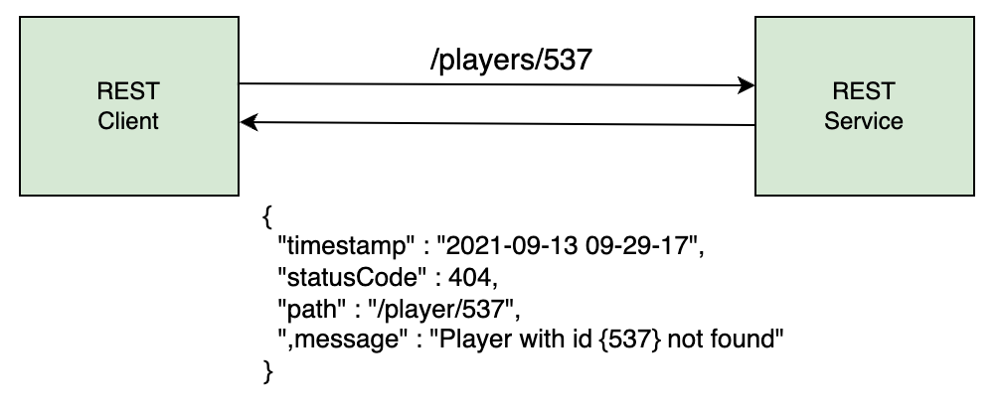
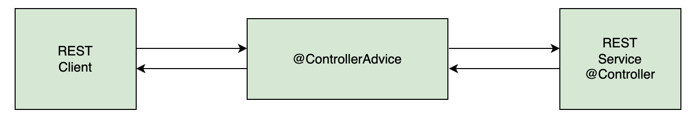
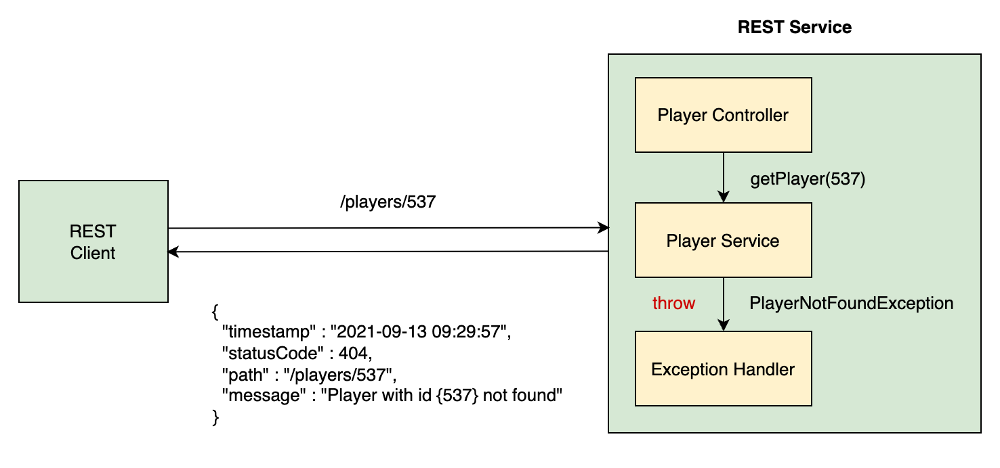

# Exception Handling
___

- We will learn how to send a client-friendly JSON response when a player record is not found. 
- The message can contain the error code, time when the error occurred, and information about why the error occurred. 
- So when the client sends a request for an Id that does not exist, say 537, the REST Service sends it a custom JSON response instead of the 500 Internal Server Error.



## Custom error response class
- In order to send a custom response to the client, we will create a class with fields like status code, error message, path/URI, and timestamp. 
- An object of this class will be created when an exception occurs and sent back to the client as the response. Jackson will automatically handle data binding and send this object as a JSON response.
- The class has a constructor to create an object using fields as well as getter and setter methods for all fields. See the code widget at the end of the lesson for complete code of the class.


```java
public class PlayerErrorResponse {
  @JsonFormat(pattern="yyyy-MM-dd HH:mm:ss")
  private ZonedDateTime timestamp;
  private int statusCode;
  private String path;
  private String message;

  //constructor
  //getters and setters
}
```
## Custom exception class
- When the REST service receives a bad request, we want it to throw an exception of our custom type. 
- Since the exception is thrown when the player is not found , we will call the class PlayerNotFoundException. This class extends the RunTimeException class.

```java
public class PlayerNotFoundException extends RuntimeException {

    // Constructor and other class members...
}
```
- The RunTimeException class contains multiple constructors and we will use one of them to throw an exception when the player is not found. 
- These constructors allow us to create instances of RuntimeException with different configurations based on our requirements.

> - `RuntimeException` is a subclass of `Exception` which implements the `Serializable` interface. Therefore, all subclasses of `Exception`, including `RuntimeException`, inherit the serializability behavior from `Exception`.
> - You may get a warning `"The serializable class PlayerNotFoundException does not declare a static final serialVersionUID field of type long"`, because it is recommended to include a `serialVersionUID` field to ensure serialization compatibility across different versions of the class. This field is used to uniquely identify the version of the class during deserialization.
> - To resolve this warning, you can manually add the `serialVersionUID` field to your `PlayerNotFoundException` class, like so:


Some common constructors available in the `RuntimeException` class which we will use in the `PlayerNotFoundException` class:
 - Default constructor: `public PlayerNotFoundException()`
 - Constructor with message: `public PlayerNotFoundException(String message)`
 - Constructor with message and cause: `public PlayerNotFoundException(String message, Throwable cause)`
 - Constructor with Cause: `public PlayerNotFoundException(Throwable cause)`


```java

public class PlayerNotFoundException extends RuntimeException{

    public PlayerNotFoundException(){
        super();
    }

    public PlayerNotFoundException(String message, Throwable cause, boolean enableSuppression,
                                   boolean writableStackTrace) {
        super(message, cause, enableSuppression, writableStackTrace);

    }

    public PlayerNotFoundException(String message, Throwable cause) {
        super(message, cause);

    }

    public PlayerNotFoundException(String message) {
        super(message);

    }

    public PlayerNotFoundException(Throwable cause) {
        super(cause);
    }

}
```
- These constructors provide flexibility in how to handle runtime exceptions in the code. 
- We can choose the appropriate constructor based on the situation and the information we want to convey when an exception occurs.

## throw exception
- Now that we have defined a custom exception class, we are in a position to throw exceptions of this class. 
- `PlayerNotFoundException` will be thrown at multiple places in the code. 
- In the `PlayerService` class, the player Id is received by the following methods: `getPlayer()`, `updatePlayer()`, `patch()`, `updateTitles()`, and `deletePlayer()`. 
- We will update these methods to check if the ID received is valid and throw a `PlayerNotFoundException` if there is no record in the database for the given Id.

In the `getPlayer()` method, the player record is retrieved in an `Optional` called `tempPlayer`. The `isPresent()` method on the `Optional` checks for absence of null values and we will throw the `PlayerNotFoundException` in the else clause as shown below:
```java
public Player getPlayer(int id) {
  Optional<Player> tempPlayer = repo.findById(id);
  Player p = null;
  //if the Optional has a value, assign it to p		
  if(tempPlayer.isPresent())
      p = tempPlayer.get();

  //if value is not found, throw a runtime exception		
  else
      throw new PlayerNotFoundException("Player with id "+ id +" not found");

  return tempPlayer.get();
}
```

We will use a similar approach in the updatePlayer method. First, use the given ID to retrieve the player from the database. If the isEmpty() method returns true meaning the player record does not exist, we will throw the PlayerNotFoundException. If a player record exists we update it in the else clause. The modified methods is shown below:

```java
public Player updatePlayer(int id, Player p) {
  Optional<Player> tempPlayer = repo.findById(id);

  if(tempPlayer.isEmpty())
      throw new PlayerNotFoundException("Player with id "+ id +" not found");

  p.setId(id);
  return repo.save(p);
}
```
We use same approach in the updateTitles method as shown below:
```java
@Transactional
public void updateTitles(int id, int titles) {
  Optional<Player> tempPlayer = repo.findById(id);

  if(tempPlayer.isEmpty())
      throw new PlayerNotFoundException("Player with id "+ id +" not found");

  repo.updateTitles(id, titles);
}
```

The deletePlayer method returns a String if the player ID is not found. We will throw the PlayerNotFoundException exception in its place as shown.
```java
public String deletePlayer(int id) {
  Optional<Player> tempPlayer = repo.findById(id);

  if(tempPlayer.isEmpty()) {
    throw new PlayerNotFoundException("Player with id "+ id + " not found.");
  }

  repo.delete(tempPlayer.get());
  return "Player with id "+ id +" deleted";
}
```
The patch() method makes use of isPresent() instead of isEmpty() on the Optional. If the record has been retrieved, we will apply the patch, otherwise throw the PlayerNotFoundException. The code is shown below:

```java
public Player patch( int id, Map<String, Object> partialPlayer) {
  Optional<Player> player = repo.findById(id);

  if(player.isPresent()) {			
      partialPlayer.forEach( (key, value) -> {
        System.out.println("Key: " + key + " Value: " + value);
        Field field = ReflectionUtils.findField(Player.class, key);
        ReflectionUtils.makeAccessible(field);
        ReflectionUtils.setField(field, player.get(), value);
      });
  }
  else
    throw new PlayerNotFoundException("Player with id {"+ id +"} not found");

  return repo.save(player.get());				
}
```

## @ControllerAdvice
- A best practice in exception handling is to have centralized exception handlers that can be used by all controllers in the REST API. 
- Since exception handling is a cross-cutting concern, Spring provides the @ControllerAdvice annotation. This annotation intercepts requests going to the controller and responses coming from controllers.

- The `@ControllerAdvice` annotation can be used as an interceptor of exceptions thrown by methods annotated with `@RequestMapping` or any of its shortcut annotations. 
- The exception handling logic is contained in the global exception handler which handles all exceptions thrown by the `PlayerController`.

- We will create a new class PlayerExceptionHandler, and annotate it with the @ControllerAdvice annotation so it can act as a global exception handler.
```java
@ControllerAdvice
public class PlayerExceptionHandler {

}
```
- This class will have methods to handle different types of exceptions. We will write a handler method to catch the PlayerNotFoundException exception thrown by the methods in PlayerService class. This handler method will create an appropriate response for the client.
- Create a method playerNotFoundHandler() in the PlayerExceptionHandler class. The input to this method is the type of the exception it will handle as well as the HttpServletRequest object. In our case, the exception will be of type PlayerNotFoundException. The method returns a ResponseEntity object containing the HTTP response when the exception occurs.
- An HTTP response message has three parts: response line, header and body. We can set these attributes in our handler method and configure the HTTP response. The ResponseEntity object is generic and we can send any type as the response body. In our case, the response body will contain an object of the PlayerErrorResponse class.
```java
public ResponseEntity<PlayerErrorResponse> playerNotFoundHandler (PlayerNotFoundException exception, HttpServletRequest req) {
}
```

## @ExceptionHandler
- The `@ExceptonHandler` annotation on a method, marks it as a method that will handle exceptions. Spring automatically checks all methods marked with this annotation when an exception is thrown. If it finds a method whose input type matches the exception thrown, the method will be executed.
```java
@ExceptonHandler
public ResponseEntity<PlayerErrorResponse> playerNotFoundHandler(PlayerNotFoundException exception, HttpServletRequest req) {

}
```
- Inside the handler method, we will create an object of the PlayerErrorResponse class and set its fields, then return it as a ResponseEntity object. Recall from the last lesson, that the PlayerErrorResponse class has the following fields:
```java
private ZonedDateTime timestamp;
private int statusCode;
private String path;
private String message;
```

- The code below creates a PlayerErrorResponse object called error. This will form the body of the error response.
```java
PlayerErrorResponse error = new PlayerErrorResponse(ZonedDateTime.now(),
                                                    HttpStatus.NOT_FOUND.value(), 
                                                    req.getRequestURI(), 
                                                    ex.getMessage()
                                                );
```

- To set the current time, we have used the now() function. 
- The HTTP status code of NOT_FOUND is 404. To use the integer value, we have used HttpStatus.NOT_FOUND.value(). 
- We have used the getRequestURI() method on the HttpServletRequest object to get the path at which the exception occurred. 
- The details about the error are contained in the exception and we have used the getmessage() method to extract the message and use it in our response.

In addition to the body of the response, we will also return the appropriate status code with the response. The status code for NOT_FOUND is 404. The last step is to create and return a ResponseEntity object as follows:
```java
return new ResponseEntity<> (error, HttpStatus.NOT_FOUND);
```

The `ResponseEntity` class provides a variety of constructors to create an object using the status code, header and body or a combination of the three. Here, we have used the constructor which creates a `ResponseEntity` object with a given body and status code. The other constructor variants for creating the `ResponseEntity` object are:
- `ResponseEntity(HttpStatus status)`
- `ResponseEntity(MultiValueMap<String, String> headers, HttpStatus status)`
- `ResponseEntity(T body, MultiValueMap<String, String> headers, HttpStatus status)`

The complete code of the handler method is shown below:
```java
@ExceptionHandler
public ResponseEntity<PlayerErrorResponse> playerNotFoundHandler (PlayerNotFoundException ex, HttpServletRequest req) {
    PlayerErrorResponse error = new PlayerErrorResponse(
                                                  ZonedDateTime.now(),
                                                  HttpStatus.NOT_FOUND.value(),
                                                  req.getRequestURI(),
                                                  ex.getMessage());
    
    return new ResponseEntity<> (error, HttpStatus.NOT_FOUND);
}
```
The body of the response will automatically be converted to JSON and sent to the client.

We can test the application by sending a GET request to `/players/537`. When the REST Service receives a bad request, it will return a custom JSON response instead of the `500` Internal Server Error. The response header also shows the `404 status code`.

```java


public class PlayerNotFoundException extends RuntimeException{
    
	public PlayerNotFoundException() {
		super();
	}

	public PlayerNotFoundException(String message, Throwable cause, boolean enableSuppression,
			boolean writableStackTrace) {
		super(message, cause, enableSuppression, writableStackTrace);
	}

	public PlayerNotFoundException(String message, Throwable cause) {
		super(message, cause);
	}

	public PlayerNotFoundException(String message) {
		super(message);
	}

	public PlayerNotFoundException(Throwable cause) {
		super(cause);
	}

}

```

## Generic exception handler
It is always a good idea to create a handler to catch all exceptions and send a custom response. We will define another exception handler method called `genericHandler()`. The method signature is the same as the previous handler except for the input type, which is the parent class, `Exception` (as opposed to `PlayerNotFoundException` used in the previous handler method).

```java
@ExceptionHandler
public ResponseEntity<PlayerErrorResponse> genericHandler ( Exception ex, HttpServletRequest req){
  
}
```
Inside the method, we will create a PlayerErrorResponse object, which is the body of the response. Since this method is a generic exception handler, it will set the status code to 400, which corresponds to the HTTP status code for BAD_REQUEST.
```java
@ExceptionHandler
public ResponseEntity<PlayerErrorResponse> genericHandler (Exception ex, HttpServletRequest req)
{

    PlayerErrorResponse error = new PlayerErrorResponse(
                                              ZonedDateTime.now(),
                                              HttpStatus.BAD_REQUEST.value(),
                                              req.getRequestURI(),
                                              ex.getMessage());

    return new ResponseEntity<> (error, HttpStatus.BAD_REQUEST);
}
```
The ResponseEntity object is returned with the response body and the HTTP status of BAD_REQUEST.

The new handler can be tested by sending a GET request to players/abc. This handler is also be executed in case of a bad POST request such as:
```json
{
    "name": "Federer",
    "nationality": "Switzerland",
    "birthDate": "22/05/84",
    "titles": 151
}
```